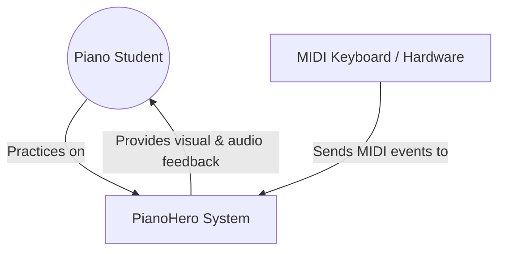

# C4 Model: PianoHero Architecture

We use the **C4 Model** (Context, Container, Component, Code) to visualize our architecture at different levels of abstraction.

## 🟢 Level 1: System Context Diagram

The highest level of abstraction, showing how PianoHero interacts with the user and external systems.



---

## 🔵 Level 2: Container Diagram

Shows the high-level technical building blocks of the PianoHero system.

```mermaid
graph TD
    subgraph PianoHero App (Electron)
        Main[Main Process / Electron Node.js]
        Renderer[Renderer Process / React + Vite]
    end

    subgraph External
        MIDI[MIDI Hardware]
        FS[Local Filesystem / MIDI Files]
    end

    User((Piano Student))

    User -- Interacts with --> Renderer
    Renderer -- IPC Communication --> Main
    Main -- Reads/Writes --> FS
    MIDI -- USB/MIDI Input --> Renderer
    Renderer -- Audio Output --> User
```

---

## 🟡 Level 3: Component Diagram (Renderer Process)

A deeper look into the components inside the Renderer process, following Clean Architecture.

```mermaid
graph TD
    subgraph UI (Presentation)
        Screens[React Screens]
        PianoUI[Piano Component]
    end

    subgraph Core (Domain & Use Cases)
        Engine[Practice Engine]
        Detection[Chord Detection]
        Catalog[Practice Catalog]
    end

    subgraph Adapters (Infrastructure)
        MidiAdapter[MIDI Adapter]
        Audio[Audio Player / Tone.js]
        Scheduler[Audio Scheduler]
    end

    Screens -- Uses --> Engine
    Engine -- Uses --> Detection
    Engine -- Uses --> Catalog

    MidiAdapter -- Injects events into --> Engine
    Engine -- Commands --> Audio
    Scheduler -- Synchronizes --> Audio
```

---

## 🟣 Level 4: Code Diagram

For Level 4, we refer to our [Clean Architecture](./clean-architecture.md) documentation which maps these components to specific directories and files in the codebase.

---

> The C4 model provides a "zoomable" view of the system, useful for both high-level stakeholders and deep-dive engineering.
